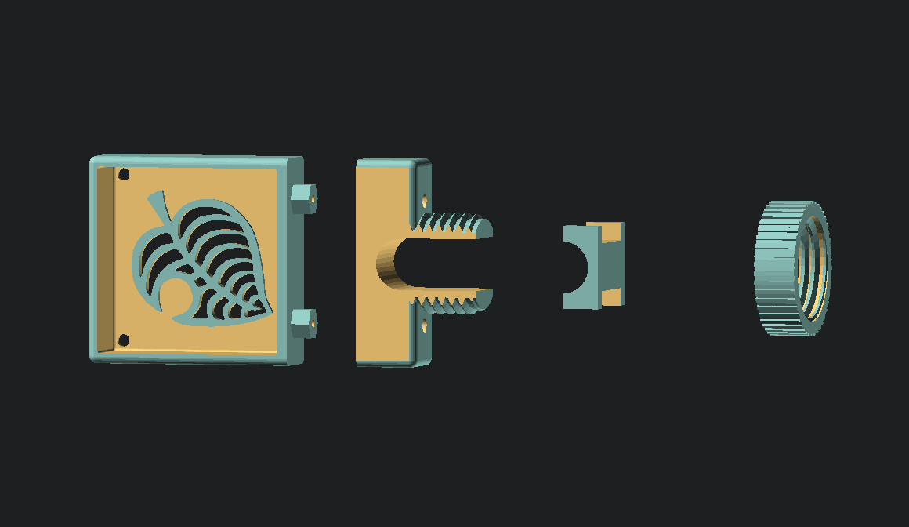
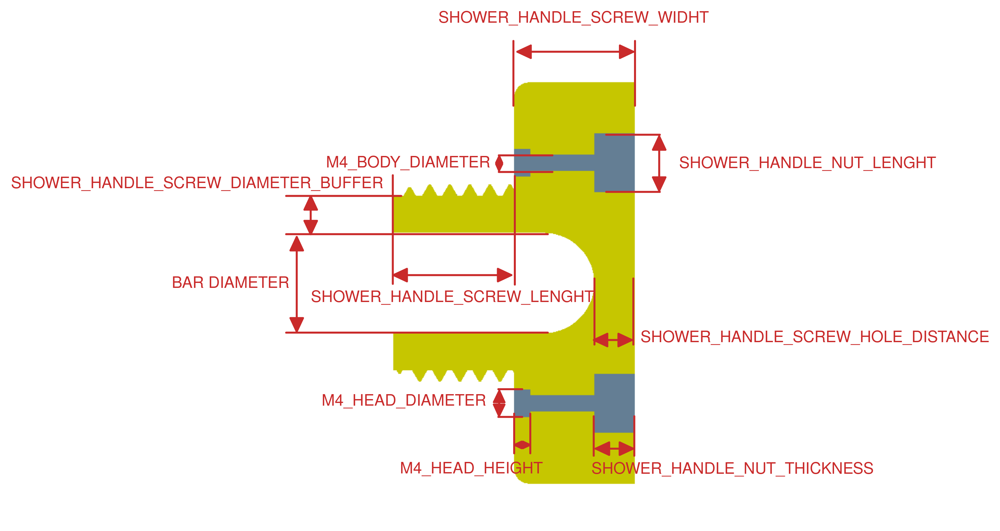
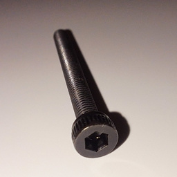
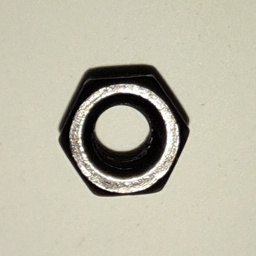

# shower-holder-support

## OpenSCAD dependencies

- [NopSCADlib](https://github.com/nophead/NopSCADlib)
- [BSOL](https://github.com/revarbat/BOSL)

## Parameters

Parameters can be change inside [./src/parameters.scad](./src/parameters.scad)

## Assembly

Required hardwares:

| # | Hardware | Image |
| --- | --- | --- |
| 2 | M3 x 30 Hexagon socket Head Cap Screws |  |
| 2 | M3 hex nut |  |
